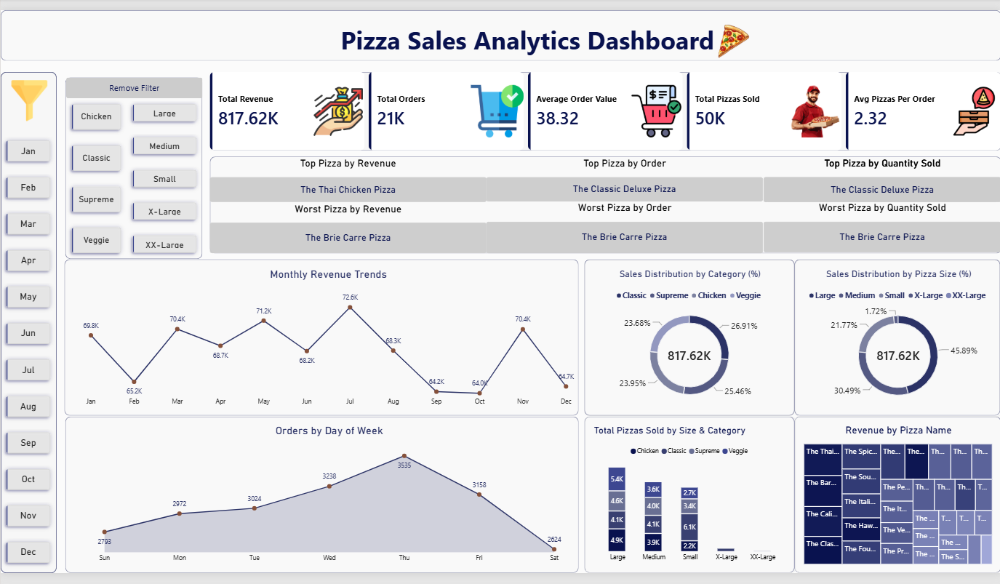

# 🍕 Pizza Sales Analytics Dashboard

## 📌 Project Overview

In this project, I have analyzed the sales data of a pizza restaurant to analyze the sales performance, customer ordering behavior, product performance and revenue trends.

In this project, I have used **SQL for data analysis** and **Power BI for data visualization**.

## 🎯 Business Objective

The main objective of this project is to analyze the sales data of a pizza restaurant and find out:

- Overall revenue performance
- Total number of orders
- Total number of pizzas sold
- Average Order Value
- Average pizzas per order
- Monthly revenue trends
- Orders by day of the week
- Sales distribution by pizza category
- Sales distribution by pizza size
- Best and worst performing pizzas

## 🛠️ Tools & Technologies

- **SQL** – Data analysis and KPIs
- **Power BI** – Visualization and dashboarding
- **Excel/CSV** – Dataset and data analysis

## 📊 Key KPIs

| KPI          | Value     |
|------------- |---------: |
| Total Revenue| 817.62K  |
| Total Orders | 21,334   |
| AOV         | 38.32    |
| Total Pizzas | 49,559   |
| Pizzas/order | 2.32     |

## 🔎 Analysis Performed

### Revenue Analysis
- Total revenue analysis
- Monthly revenue trends
- Revenue by pizza name

### Order Analysis
- Total orders analysis
- Average Order Value
- Orders by day of the week

### Product Analysis
- Best pizza by revenue
- Best pizza by orders
- Best pizza by quantity
- Worst performing pizzas
  
### Category & Size Analysis
- Sales distribution by pizza category
- Sales distribution by pizza size
- Quantity of pizzas sold by size and category

## 📈 Power BI Dashboard

This dashboard presents pizza sales performance in a visualized way with KPIs, charts and filters.

## 📂 Project Files

- `pizza_sales.csv` - dataset for analysis
- `pizza_sales_queries.sql` - SQL queries for analysis
- `Pizza.pbix` - Power BI dashboard
- `pizza_sales_dashboard.png` - dashboard preview

## 💡 Key Insights

From this analysis we can understand:

- Trends in revenues during certain months
- Sales differences between pizza categories and sizes
- Best performing and poorly performing pizza products
- Customer behavior while ordering pizza in terms of days of the week

## 📚 Learning Outcome

From this project I learned how to use:

- SQL aggregation functions
- `GROUP BY`
- `ORDER BY`
- `COUNT(DISTINCT)`
- Subqueries
- Calculation of KPIs
- Data analysis
- Power BI dashboard creation
- Data visualization
- Business analysis
